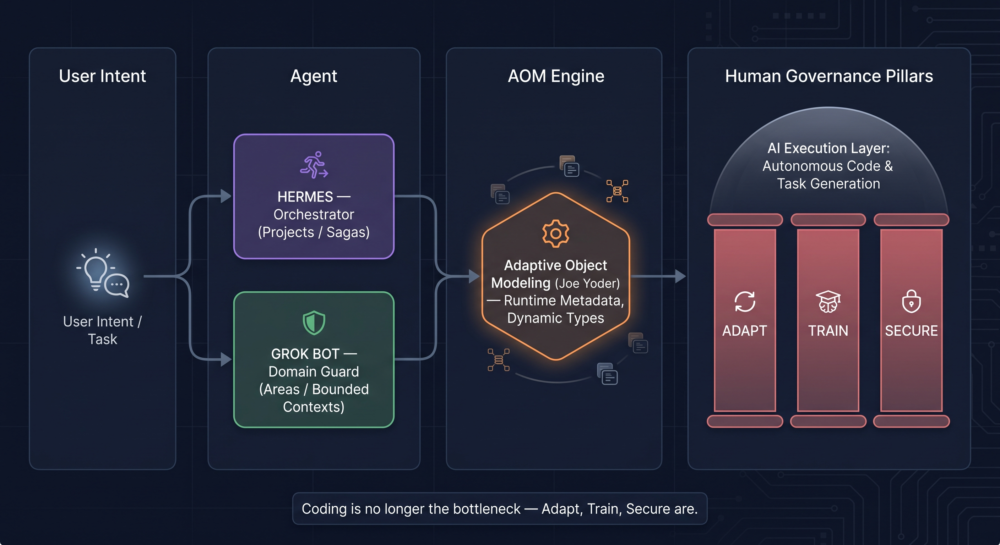

# domain-to-areas

Mapping Tiago Forte's P.A.R.A. Method onto Eric Evans' Domain-Driven Design for a multi-agent AGI framework.

## Live site

**https://rifaterdemsahin.github.io/domain-to-areas/**

## What this is

`index.html` is a single self-contained, dependency-free static page documenting the PARA→DDD mapping: Projects→Application Services/Sagas, Areas→Core Bounded Contexts/Aggregate Roots, Resources→Shared Kernel/Supporting Subdomain, Archive→Event Store/cold storage.

## Why "Areas" got enabled (and why Hermes & Grok Bot had to exist)

PARA's Areas are perpetual responsibilities with no end date. In the old task-only model, ongoing responsibility was repeatedly re-submitted as one-off tasks, so nothing accumulated and nothing was owned long-term. Enabling Areas means promoting that perpetual responsibility to an explicit, long-lived **Bounded Context / Aggregate Root** with a named owner.

- **Hermes** got enabled as the orchestrator for **Projects / Sagas**: it decomposes a user intent into transient, compensatable workflows and drives them to completion.
- **Grok Bot** got enabled as the **domain supervisor for Areas / Bounded Contexts**: it guards each Area's invariants and ubiquitous language so permanent responsibilities keep their shape over time.

The enabling step is what turns "a pile of tasks" into "an owned domain": one agent orchestrates transient work, the other supervises perpetual domains.

## Architecture & System Flow



## Compute pile-up: cloud + on-premise

Every enabled Area/Bounded Context plus each orchestrating agent (Hermes) and supervisor (Grok Bot) runs continuous, stateful, always-on workloads, and Adaptive Object Modeling needs runtime metadata storage and evaluation. With hybrid deployments, the same domain state and metadata are mirrored across **cloud** (elastic burst, RAG/search indexes, event store) and **on-premise** (data-residency, latency, regulated data) — so compute, storage, and egress charges stack rather than consolidate. Areas never "finish", so unlike a Project their footprint is permanent: agents, vector indexes, event logs and AOM metadata all accrue.

| Pile-up driver | Why it compounds |
| --- | --- |
| Always-on orchestration (Hermes) and supervision (Grok Bot) per domain | Each domain permanently runs its own long-lived, stateful agents |
| Continuous RAG/embedding refresh for Resources | Indexes must be re-embedded as content and language evolve |
| Append-only Event Store growth for Archive | History is immutable, so storage only ever grows |
| AOM runtime metadata + dynamic type evaluation | Types and their metadata are evaluated at runtime, not compile time |
| Duplicated footprint across cloud and on-premise for residency/compliance | The same state and metadata are mirrored in both environments |
| Cross-environment egress and sync costs | Keeping cloud and on-premise in sync bills for every byte moved |

## Setup

1. Create the repo (already done for `domain-to-areas`):

   ```
   gh repo create rifaterdemsahin/domain-to-areas --public
   ```

   (or create it via the GitHub UI).

2. Commit `index.html` at the repo root.

3. Enable GitHub Pages from the `main` branch root: GitHub repo → **Settings → Pages → Build and deployment → Source: Deploy from a branch → Branch: `main` / `/(root)` → Save**.

   CLI alternative:

   ```
   gh api -X POST repos/rifaterdemsahin/domain-to-areas/pages -f "source[branch]=main" -f "source[path]=/"
   ```

   (or `gh api -X PUT repos/rifaterdemsahin/domain-to-areas/pages` to update an existing Pages config).

4. Wait ~1 minute, then visit **https://rifaterdemsahin.github.io/domain-to-areas/**.

Equivalent plain git commands:

```
git add index.html README.md
git commit -m "Add PARA to DDD mapping page and README"
git push origin main
```

## Attribution

- Domain-Driven Design (Eric Evans)
- P.A.R.A. Method (Tiago Forte)
- Adaptive Object Modeling (Joe Yoder)
